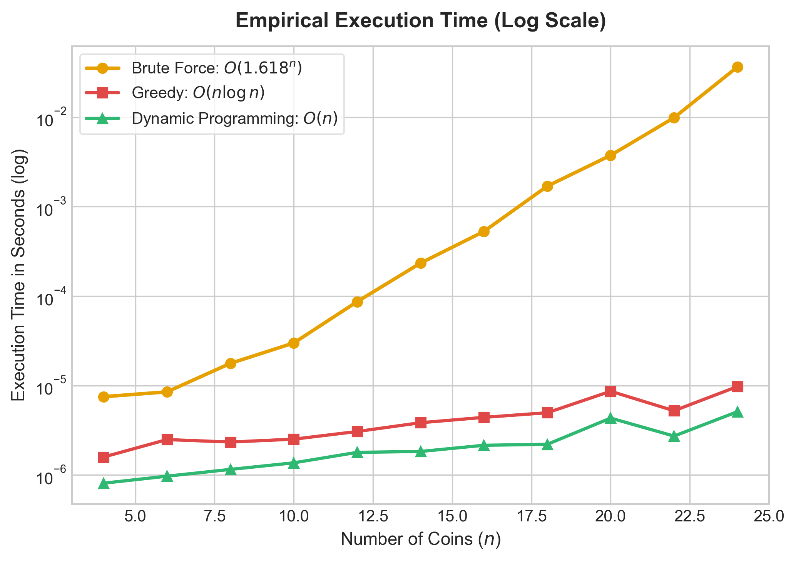

<h1>Data Structures and Algorithm - Coin Row Problem</h1>
<h5>Algorithm Analysis for the Coin Row Problem</h5>

<h6></h6>

---

## Problem

Given that a row of N coins with **positive values**:

 $$ C_1 , C_2, C_3, ..., C_n$$ 

The goal we need to achieve is to ensure that:
<ul>
    <li>Selected coins <b>HAVE</b> the <b><i>MAXIMUM TOTAL VALUE</i></b></li>
    <li><b>NO</b> two selected coins are <i>adjacent</i></li>
</ul>

Throughout this repository (or report, take it as you will lol) we'll be messing with this set of numbers using a list:

 $$ [ 5 , 1 , 9 , 10 , 9 , 2] $$ 

This repo will also only utilize Python for the programming and analysis of the Space-Time Complexity.

> If you want a cool challenge, you can always try shooting your shot in translating the code to other languages :3, do not hesitate to shoot a message if you want further clarification or if you dont understand bits of the concept.

---
## Solution

> Before we start, if you wanna run the python scripts locally, [you can click me](runLocal.md) to directly find the guide. Alternatively, [you can use cloud notebook [Google Colab] that I personally compiled here](https://colab.research.google.com/drive/1dov3ILbCXGw_so-K27xxmkmU4ijU0gKK?usp=sharing)

Honestly there are probably multiple algorithms I didn't know that you can use to solve this problem. However, I'll only be focusing on 3 strategies.

Always keep in mind that there are no "better" or all-size-fits-all algorithm, it always depends on the problem and your approach.

In this case, the 3 strategies we will use are:

<!-- no toc -->
  - [Greedy Approach](#greedy-approach)
  - [Brute Force Approach](#brute-force-approach)
  - [Dynamic Programming](#dynamic-programming)

This repo will go in-depth with each approach including the computation for the Space-Time Complexity then put these three against each other and help you understand why <b>Dynamic Programming Approach</b> is the most optimal strategy out them.

---
### Greedy Approach
##### [Click me for the code](./CoinRow-Manual/coinRow-GS.py)

Greedy Approach or Greedy Algorithm is where we will automatically collects the largest non-adjacent numbers in the list and claim it as the maximum value. (Value-first heuristic)

By itself, is probably what people would use to get the maximum value of a list. Unfortunately, this algorithm is very short-sighted.

To see what I mean, you can [run the code](./CoinRow-Manual/coinRow-GS.py) in this repo to see why. I included explanations in every major function the script has, hopefully it's technical enough but still retaining it's understandibility.

#### Algorithm's Operation

Since we do have a condition that locks the coins adjacent to it, the typical greedy implementation has 3 distinct phases.

1. **Index Tagging**: It basically pairs the coins with it's original position in the list `(value, index)` so that it's original index isn't lost as the program sorts through the list.
2. **Prioritizing through Sorting**: It sorts the coins in descending order by value, *(in the python script, i did it by using the `sort()`)* placing the numbers at the front of the queue.
3. **Iteration and Lock**: So it loops through the sorted list with the following:
      * If the coin at `index` has not been locked, then add it.
      * Flag the `index - 1`, `index`, and `index + 1` as locked.
      * If the coin is already locked, then skip and move to the next highest number. 

#### Why is it not optimal?
Well before anything, I want you to look at this algorithm's profile:

If you noticed, it's fast and it's memory is linear. However there's a caveat to it's speed. Yes, it does try to find the maximum value in one iteration, but it always takes the ***highest*** amount, and fails to account there may be other possible combination to the problem.

For this strategy to be an optimal solution, it must have *Greedy-Choice Property*, where locally optimal choices must never comprimise with the global optimum.

Coin Row Problem violates this property because of it's *no adjacent coins* rule and other group of factors:
* The coin's true worth is it's face value minus the sum of the neighbors.
* Taking Php 10 yields + 10 but other opportunity is lost by locking two Php 9 coins.
* Greedy only looks at the short-term benefit and doesn't consider the collateral damage of falling to suboptimal traps.

---
### Brute Force Approach
##### [Click me for the code](./CoinRow-Manual/coinRow-BF.py)

The brute force approach solves the Coin Row problem by exhausting it's enumeration than trying to predict which coin is the best, it recursively builds and evaluates every single valid, non-adjacent combination that the rules allow.

In short, even if you found the maximum value, you still continue to find more subset that adhere to the rules and then compare who's the highest afterwards. 

Sure, it does guarantee that you'll find the highest maximum value, but as you try to put more and more coins into that cute lil list, it may take longer than necessary just to find the maximum value.

#### Algorithm's Operation

Brute force basically imagines the coin line into a binary decision tree. Starting at the first index, every recursive step evaluates two mutually exclusive features:

1. **Take the `coin[i]`:**
   * Collect the value of `coin[i]`.
   * Enforce the non-adjacent rule by skipping the adjacent coin and recursing at `i + 2`.
2. **Skip the `coin[i]`:**
   * Collect `0` at index `i`.
   * Leave the neighbor available and recurse at `i + 1`.

Once execution branches reach the end of the line; which are the base cases, the returns basically bubbles back up the call stack. Every step, the function executes:

 $$ max(Total_{take}, Total_{skip})$$ 

Because it leaves zero possibilities unvisited, brute force technically IS guaranteed to find the maximum value.

##### Isn't it technically *Trial and Error*?
No.

To be exact, no because **trial and error** is basically a person trying to guess which works till the latch opens. While **Brute Force** is testing ***EVERYTHING*** to ensure all combination is accounted. 

#### Why is it not optimal?
You may think, *"Well, it is guaranteed to find the optimal maximum value, why is it not the best solution?* It's mostly because of how poor it is in the lens of algorithms due to how the execution time just blows out of proportion as you scale the list.

Similar on how we look at Greedy Approach, I'll show the graph for Brute Force.

As you can see, it rises up as you add more coins into the array. To be exact, it increases at the rate of the Golden Ratio as you add more coins.

Why?

Well, if you look at the recurrence relation, it's basically the fibonacci sequence:

 $$ T(n) = T(n-1) + T(n-2)$$ 

So the growth rate is basically bounded by the Golden Ratio.

It's also doing redundant work, one of the glaring flaw of brute force is that it doesn't cache!! It has no memory!!

When evaluating decisions, multiple independent branches just end up calculating the exact subproblems repeatedly from scratch. Neither branch knows the other exists, so both construct identical subtrees. As the row increase, the redundant recalculation also increase uncontrollably across thousands of identical sub-arrays.

---
### Dynamic Programming

Dynamic programming *(ill call it dp this point onward)* solves Coin Row by transforming an exponential recursive tree into a linear line. It calculates the optimal payout per prefix of the coin row from left to right, and caching each milestone so no sub problem is ever evaluated more than once.

DP basically solves all the glaring problem we have with Brute Force while maintaining consistent speed akin to Greedy algorithm, as both DP and Greedy only needs 1 pass to find the maximum value.

Look at the following graph:

DP succeeds because of the following:
* Optimal Substructure: Optimal choice for a row of length `i` directly depends on the optimal solutions to shorter sub-rows(`i-1` and `i - 2`)
* Overlapping Subproblems: Both the *"take"* and *"skip"* recursive branches examine the same sub-arrays, instead of re-traversing them like Brute force. DP solves each sub-array once and stores them in the table dp.

#### Algorithm's Operation
Rather than guessing or testing all combinations, Dynamic Programming fills another array (`dp`) with the size of `n` in 3 phases:

1. **Base Case Initialization:**
   * For the first coin: `dp[0] = C[0]`.
   * For the first two coins: You cannot take both adjacent coins, so pick the larger: `dp[1] = max(C[0], C[1])`
2. **Iterative Table Filling:**
   For every position from index $2$ to $n-1$, evaluate the two valid options and store the winner:$$dp[i] = \max(C[i] + dp[i-2],\; dp[i-1])$$
   * Take `C[i]`: Gain `C[i]` plus the cached optimal total from two spots back (`dp[i-2]`).
   * Skip `C[i]`: Gain `0`, carrying forward the optimal total achieved through the neighbor (`dp[i-1]`).
3. **Backtracking**
   Starting from the last element (`dp[n-1]`), trace backward to check whether each index matched the "take" or "skip" equation, collecting the exact coins that formed the maximum sum.

#### Why is it better in Coin Row Problem?
Unlike Greedy that just takes the local maximum and locked it's adjacent neighbors without thinking, DP never commits that way.

Because it simultaneously checked the value of taking something with an accumulated score, it recognized mathematically that it should ensure it will find which coins yield more value than just the highest local maximum. It also captures the global maximum with just $O(n)$ time.

---
### Greedy vs Brute Force vs Dynamic

Now that we've broken down each approach individually, let's throw all three of them into the ring together and see how they actually hold up against each other side-by-side.

Here's a quick scorecard before we look at the empirical benchmarks:

  
  

#### Execution Time Comparison
To test their speed, I ran all three algorithms through rows of random coins ranging from $n = 4$ up to $n = 24$.

If you look at the Y-axis, it uses a logarithmic scale (seconds), and that's for a very good reason:

* **Brute Force (Yellow)**: On a log scale, an exponential function plots as a straight diagonal line. As you add more coins, the runtime shoots up exponentially ($O(1.618^n)$). While it finishes under a millisecond at $n = 10$, it rockets past $30ms$ at $n = 24$. If we pushed this test to just $n = 40$, Brute Force would take minutes to finish a single run.

* **Greedy (Red) vs DP (Green)**: Both stay completely grounded at the floor of the graph in the microsecond range ($10^{-6}s$).

* Notice that **Dynamic Programming** is consistently faster than Greedy. Even though Greedy feels simple, it still has to sort the coins ($O(n \log n)$) and manage lookup tuples, whereas DP just slides smoothly through the array in a single linear pass ($O(n)$).

#### Auxiliary Memory 
Now look at the memory chart, because this is where things get really interesting:

You might be asking: 
"Wait, why are all three algorithms practically hugging each other along the same $O(n)$ diagonal line?"

Here's the distinction between time and space:
* **Time** is *cumulative*: every function call you make adds to the total clock runtime forever.
* **Space** is *reusable*: memory can be freed and recycled as soon as a step is done!

Even though Brute Force visits millions of combinations, it uses **Depth-First Search (DFS)**. It only explores one path down to the leaf, records the value, and immediately pops that stack frame off the call stack. So at any single millisecond, the stack never exceeds $n$ frames.

* Brute Force: Peak call stack depth is $O(n)$.
* Greedy: Needs tracking arrays (locked and indexed_coins) which take $O(n)$ space.
* DP (Table): Standard memoization table stores $n$ subproblem answers ($O(n)$).
* DP (Space-Optimized): If you only care about the maximum total and don't need to backtrack the winning coins, you don't even need the table! You only need to keep track of the last two numbers ($dp[i-1]$ and $dp[i-2]$), dropping the memory footprint to a flat line of $O(1)$ scalar variables.

---
### Conclusion

So, what did we learn from pitting these three paradigms against each other?

* *Greedy is fast, but too short-sighted for this problem*: Greedy algorithms are great when local choices lead directly to global perfection. But because the Coin Row problem penalizes you for picking a number by destroying its neighbors, Greedy's blind grab for the largest number makes it fundamentally unreliable. It sacrifices long-term payoff for short-term gain.

* *Brute Force is mathematically sound, but algorithmically impractical*: Exhaustive search guarantees you'll get the highest payout, but its lack of memory makes it unscalable. Doing identical calculations repeatedly across independent branches causes an exponential explosion ($O(1.618^n)$) that quickly renders it unusable for real-world list sizes.

* *Dynamic Programming is da goat here*: DP gives us the exact correctness of Brute Force paired with the blazing speed of Greedy. By recognizing that large coin rows share identical subproblems, it caches intermediate milestones and resolves the entire puzzle in a single, predictable linear pass ($O(n)$).
  
Space complexity alone doesn't tell you if an algorithm is efficient. Brute Force and Dynamic Programming use virtually the same amount of auxiliary memory ($O(n)$), but Dynamic Programming actually uses that space purposefully to turn an impossible exponential tree into an effortless linear stroll.
